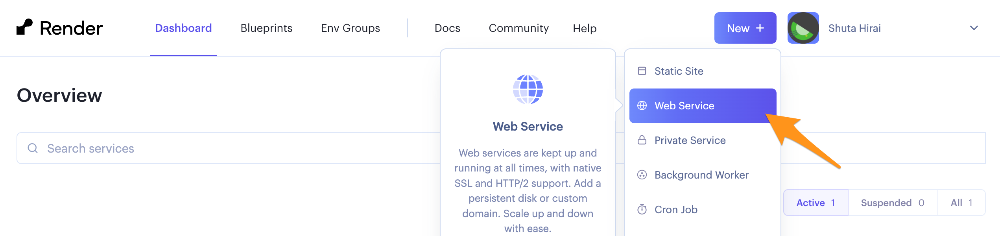
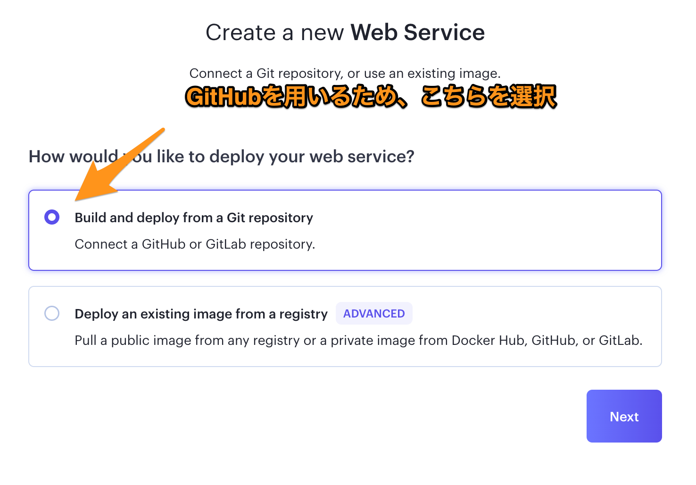
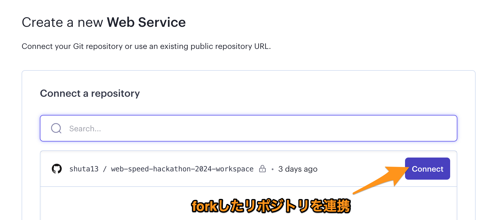
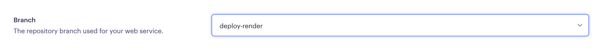
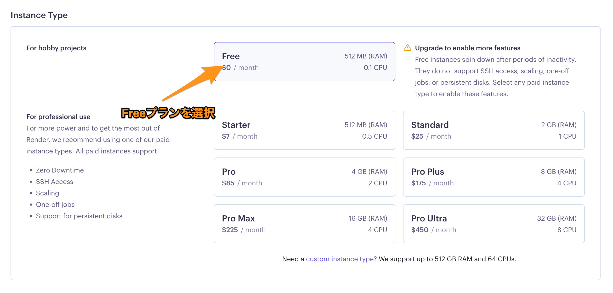
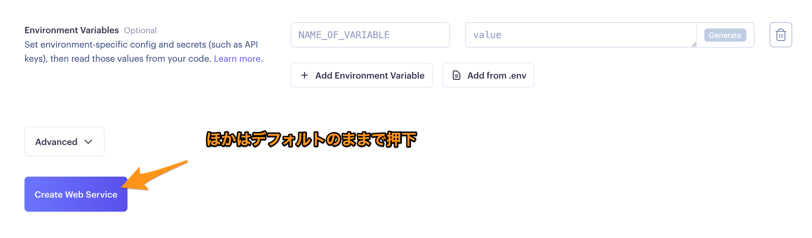

## Koyeb.com へデプロイする場合（推奨 / 無料）

[Koyeb 公式ドキュメント](https://www.koyeb.com/docs/build-and-deploy/build-from-git) も参照してください。

もし、デプロイで問題が起きた場合、競技時間内であれば運営がサポートします。

1. このレポジトリを自分のレポジトリに fork します
   - https://github.com/CyberAgentHack/web-speed-hackathon-2024/fork
2. [Koyeb.com](https://app.koyeb.com/auth/signin) にログインします
3. 「Create Web Servie」を選択します
   - 
4. 「GitHub」を選択します
   - 
5. Fork したレポジトリを選択します
   - 
6. フォークしたレポジトリの main ブランチが変更されると、自動でデプロイされます

## Render へデプロイする場合

> Koyeb へのアクセスができない場合、こちらの方法を利用してください。

[Render 公式ドキュメント](https://render.com/docs) も参照してください。

1. このレポジトリを自分のレポジトリに fork します
   - https://github.com/CyberAgentHack/web-speed-hackathon-2024/fork
2. ブランチを deploy-render に変更します
3. [render.com](https://dashboard.render.com) にログインします
4. Dashboard から `New +` を選択し、`Web Service` を選択します。
   - 
5. `Build and deploy from a Git repository` を選択します。
   - 
6. Fork したレポジトリを選択します。
   - 
7. Branch は `deploy-render` を選択します。
   - 
8. Free プランを選択します。
   - 
9. ほかはデフォルトのままで `Create Web Service` を選択します。
   - 
10. フォークしたレポジトリの main ブランチが変更されると、自動でデプロイされます。

## Koyeb.com 外へデプロイする場合

- 無料の範囲内であれば、Koyeb.com 以外へデプロイしてもかまいません
  - **外部のサービスは全て無料枠の範囲内で使用してください**
    - :warning: **万が一コストが発生した場合は、全て自己負担となります**
  - Koyeb.com 外へのデプロイについて、運営からサポートしません
  - デプロイ方法がわからない方は Koyeb.com で立ち上げることをオススメします
